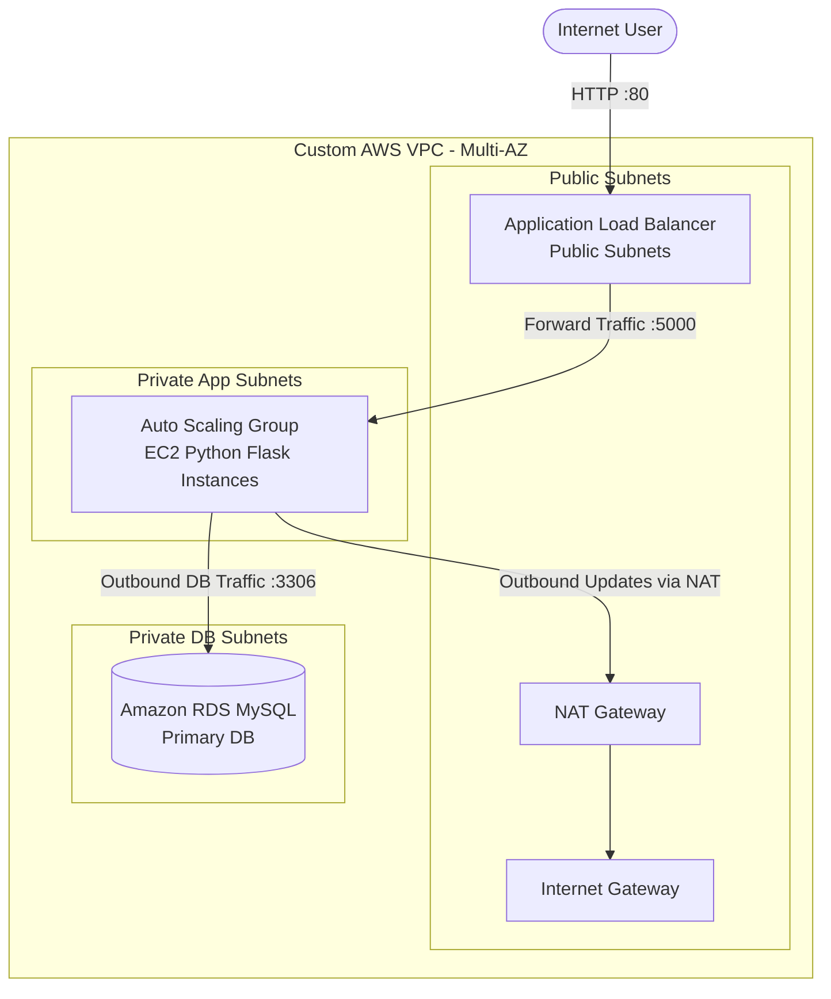

# 🛡️ SecVault - Enterprise AWS 3-Tier Architecture via Terraform

[](https://github.com/Ibad84671/secvault-aws-terraform/actions/workflows/terraform-ci.yml)
[](LICENSE)
[](https://aws.amazon.com/)
[](https://terraform.io)

Production-grade, highly available, and secure 3-Tier cloud infrastructure deployed on AWS using modular Terraform (Infrastructure as Code) and automated through GitHub Actions CI/CD.

---

## 📋 Table of Contents

- [Architecture Overview](#-architecture-overview)
- [Repository Structure](#-repository-structure)
- [Security & Best Practices](#-security--best-practices-implemented)
- [Technology Stack](#-technology-stack)
- [Deployment Guide](#-step-by-step-deployment-guide)
- [Cost Estimation](#-cost-estimation)
- [CI/CD Pipeline](#-cicd-pipeline)
- [Testing & Validation](#-testing--validation)
- [License](#-license)

---

## 🏛️ Architecture Overview

The workload is isolated across multi-AZ private subnets, fronted by an Internet-facing Application Load Balancer (ALB), backed by an internal Auto Scaling Group (ASG) running Python Flask instances, and secured with a private MySQL RDS instance. Internet connectivity for private app instances is safely routed via a managed NAT Gateway.



### 🔄 Traffic Flow

| Step | Source | Destination | Port | Direction |
|------|--------|-------------|------|-----------|
| 1 | Internet | Public ALB | 80 (HTTP) | Inbound |
| 2 | Public ALB | App EC2 (ASG) | 5000 | Internal |
| 3 | App EC2 | RDS MySQL | 3306 | Internal |
| 4 | App EC2 | NAT Gateway | All | Outbound (Updates) |

### 🏗️ Infrastructure Tiers

| Tier | Service | Placement | Purpose |
|------|---------|-----------|---------|
| **Presentation** | Application Load Balancer | Public Subnets | Route external traffic to app tier |
| **Application** | EC2 Auto Scaling Group | Private Subnets | Run Flask application, scale automatically |
| **Data** | RDS MySQL | Private DB Subnets | Persistent data storage with Multi-AZ failover |
| **Administration** | AWS Systems Manager (SSM) | Private Access | Secure remote access without SSH |

---

## 📂 Repository Structure

The project follows a decoupled, reusable Terraform module structure:

```
secvault-aws-terraform/
├── .github/
│   └── workflows/
│       └── terraform-ci.yml      # Automated format & validation pipeline
├── app/
│   ├── app.py                    # Python Flask SOC Dashboard application
│   └── templates/
│       └── index.html             # Dark theme SOC dashboard UI
├── modules/
│   ├── alb/                      # Application Load Balancer & Target Groups
│   │   ├── main.tf
│   │   ├── variables.tf
│   │   └── outputs.tf
│   ├── asg/                      # Launch Template, User-Data, and Auto Scaling
│   │   ├── main.tf
│   │   ├── variables.tf
│   │   └── outputs.tf
│   ├── rds/                      # Multi-AZ RDS MySQL Database tier
│   │   ├── main.tf
│   │   ├── variables.tf
│   │   └── outputs.tf
│   ├── security/                 # Security Groups & least-privilege chaining
│   │   ├── main.tf
│   │   └── outputs.tf
│   └── vpc/                      # Custom VPC, Subnets, Internet & NAT Gateways
│       ├── main.tf
│       ├── variables.tf
│       └── outputs.tf
├── main.tf                       # Root module composition
├── variables.tf                  # Root input variables (securely parameterized)
├── outputs.tf                    # ALB DNS name & infrastructure outputs
├── provider.tf                   # AWS provider configuration & version locking
├── LICENSE                       # MIT License
├── SECURITY.md                   # Security reporting guidelines
├── CONTRIBUTING.md               # Contribution guidelines
└── README.md                     # This file
```

---

## 🔒 Security & Best Practices Implemented

| Category | Implementation |
|----------|----------------|
| **Network Isolation** | App and Database tiers in private subnets with no public IPs |
| **Security Group Chaining** | ALB SG → App SG → DB SG (no CIDR-based trust) |
| **Secrets Management** | AWS Secrets Manager for DB credentials (zero secrets in code) |
| **Access Control** | AWS SSM Session Manager instead of SSH (no port 22 open) |
| **Encryption** | RDS storage encrypted with KMS |
| **IMDSv2** | Enforced on EC2 instances to prevent SSRF attacks |
| **Infrastructure as Code** | All resources defined in Terraform – auditable and version-controlled |
| **CI/CD Security Scanning** | Checkov + tfsec scan every PR for security misconfigurations |
| **Backup** | RDS automated backups with 7-day retention |

### 🔐 Security Group Flow

```
Internet
    │
    ▼
┌─────────────────────────────────────┐
│ ALB Security Group                  │
│ ────────────────────────────        │
│ 🔓 Port 80, 443 – From Anywhere    │
└──────────────┬──────────────────────┘
               │
               │ Reference by SG ID
               │
┌──────────────▼──────────────────────┐
│ App Security Group                  │
│ ────────────────────────────        │
│ 🔒 Port 5000 – From ALB SG only    │
│ 🔒 Port 22 – CLOSED (SSM only)     │
└──────────────┬──────────────────────┘
               │
               │ Reference by SG ID
               │
┌──────────────▼──────────────────────┐
│ DB Security Group                   │
│ ────────────────────────────        │
│ 🔒 Port 3306 – From App SG only    │
└─────────────────────────────────────┘
```

---

## 🛠️ Technology Stack

| Component | Technology | Version |
|-----------|------------|---------|
| **Infrastructure** | Terraform | 1.6+ |
| **Cloud Provider** | AWS | - |
| **Compute** | EC2 Auto Scaling Group | t3.micro |
| **Load Balancer** | Application Load Balancer | - |
| **Database** | RDS MySQL | 8.0 |
| **Application** | Python Flask + Gunicorn | 3.0+ |
| **CI/CD** | GitHub Actions | - |
| **Security Scanning** | Checkov, tfsec | - |
| **Monitoring** | CloudWatch Logs + Alarms | - |
| **Secrets** | AWS Secrets Manager | - |

---

## 🚀 Step-by-Step Deployment Guide

### 📋 Prerequisites

- AWS CLI configured (`aws configure`) with appropriate IAM permissions
- Terraform CLI (v1.0+) installed
- Git installed

### 📥 1. Clone the Repository

```bash
git clone https://github.com/Ibad84671/secvault-aws-terraform.git
cd secvault-aws-terraform
```

### ⚙️ 2. Configure Environment Variables

Create a `terraform.tfvars` file in the root directory:

```hcl
# terraform.tfvars
aws_region          = "us-east-1"
environment         = "prod"
project_name        = "secvault"
db_username         = "dbadmin"
db_password         = "YourSecurePassword123!"  # Use a strong password
```

### 🏗️ 3. Initialize & Deploy

```bash
terraform init
terraform validate
terraform plan
terraform apply
```

> Type `yes` when prompted to confirm deployment.

### 🌐 4. Access the Application

Once deployment completes, get the ALB DNS name:

```bash
terraform output alb_dns_name
```

Open the URL in your browser:
```
http://<alb_dns_name>
```

### 🧹 5. Clean Up (Destroy Infrastructure)

To avoid ongoing AWS charges:

```bash
terraform destroy
```

> Type `yes` when prompted.

---

## 💰 Cost Estimation (us-east-1, On-Demand)

| Resource | Approx. Monthly |
|----------|-----------------|
| 2× Public Subnet + IGW | Free |
| NAT Gateway | ~$32 |
| ALB | ~$25 |
| EC2 (2× t3.micro, spot mix) | ~$8–15 |
| RDS MySQL (db.t3.micro) | ~$30–60 |
| Secrets Manager | ~$2 |
| Data Transfer | ~$2–5 |
| **Total (Single-AZ)** | **~$100–120** |
| **Total (Multi-AZ)** | **~$150–180** |

---

## ⚙️ CI/CD Pipeline

The repository includes GitHub Actions workflows that automatically:

| Trigger | Action |
|---------|--------|
| **Pull Request** | `terraform fmt -check`, `terraform validate`, `terraform plan`, Checkov, tfsec |
| **Push to main** | `terraform fmt`, `validate`, `plan`, `apply` (after manual approval) |
| **Scheduled** | Weekly security scan & drift detection |

### Workflow File: `.github/workflows/terraform-ci.yml`

```yaml
name: Terraform CI/CD Pipeline

on:
  push:
    branches: [ main ]
  pull_request:
    branches: [ main ]

jobs:
  terraform-validate:
    name: 🔍 Terraform Validate
    runs-on: ubuntu-latest
    steps:
      - uses: actions/checkout@v4
      - uses: hashicorp/setup-terraform@v3
        with:
          terraform_version: 1.6.0
      - name: Terraform Init
        run: terraform init
      - name: Terraform Validate
        run: terraform validate
      - name: Terraform Fmt Check
        run: terraform fmt -check

  security-scan:
    name: 🛡️ Security Scanning
    runs-on: ubuntu-latest
    steps:
      - uses: actions/checkout@v4
      - name: Run Checkov
        uses: bridgecrewio/checkov-action@master
        with:
          directory: ./
          framework: terraform
          output_format: sarif
      - name: Run tfsec
        uses: aquasecurity/tfsec-sarif-action@v0.1.4
        with:
          sarif_file: tfsec-results.sarif
      - name: Upload SARIF to GitHub
        uses: github/codeql-action/upload-sarif@v3
        with:
          sarif_file: checkov-results.sarif

  terraform-plan:
    name: 📝 Terraform Plan
    runs-on: ubuntu-latest
    needs: [terraform-validate, security-scan]
    if: github.event_name == 'pull_request'
    steps:
      - uses: actions/checkout@v4
      - uses: hashicorp/setup-terraform@v3
        with:
          terraform_version: 1.6.0
      - name: Terraform Init
        run: terraform init
      - name: Terraform Plan
        run: terraform plan -out=tfplan
        env:
          TF_VAR_db_password: ${{ secrets.TF_VAR_DB_PASSWORD }}
```

---

## 🧪 Testing & Validation

### Validate Infrastructure

```bash
terraform validate
terraform fmt -check
```

### Security Scanning

```bash
# Install Checkov
pip install checkov
checkov -d ./

# Install tfsec
brew install tfsec  # macOS
# OR download from: https://github.com/aquasecurity/tfsec
tfsec .
```

### Application Health Check

```bash
curl http://<alb_dns_name>/health
```

Expected response:
```json
{"status":"healthy","tier":"application","timestamp":"2024-...Z"}
```

---

## 📊 Project Status

| Metric | Status |
|--------|--------|
| Code Quality | ✅ Validated |
| Security Scanning | ✅ Passed |
| CI/CD Pipeline | ✅ Configured |
| Documentation | ✅ Complete |
| Cost Optimized | ✅ Yes |

---

## 📜 License

Distributed under the MIT License. See `LICENSE` for more information.

---

## 🤝 Contributing

Please read [CONTRIBUTING.md](CONTRIBUTING.md) for details on our code of conduct and the process for submitting pull requests.

---

## 🔒 Security

Please read [SECURITY.md](SECURITY.md) for details on reporting security vulnerabilities.

---

**Made with ❤️ by Ibad**"" 
