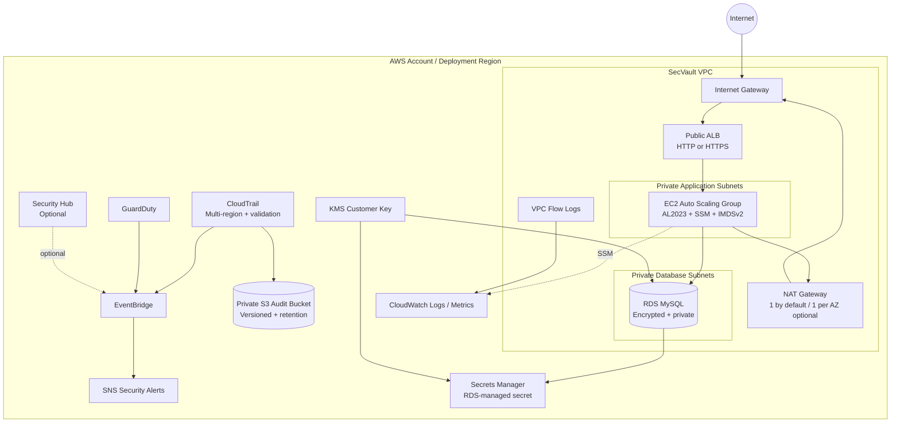
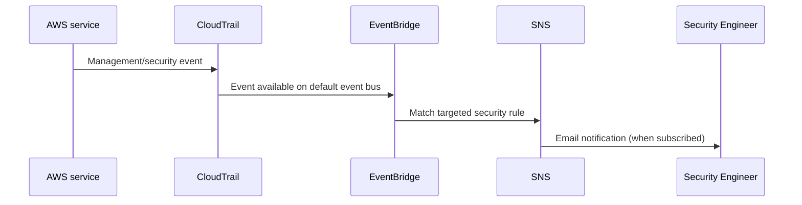

# 🔐 SecVault

**Production-minded AWS security infrastructure engineered with Terraform.**

SecVault is a security-focused AWS 3-tier workload that demonstrates defense-in-depth across identity, network isolation, encryption, audit logging, threat detection, alerting, and Infrastructure as Code.

> Security is treated as a system: prevent exposure, reduce privilege, capture evidence, detect meaningful events, and automate the response path.

[](https://github.com/Ibad84671/secvault-aws-terraform/actions/workflows/terraform-ci.yml)
[](https://www.terraform.io/)
[](https://aws.amazon.com/security/)
[](LICENSE)

---

## Why SecVault?

SecVault is intentionally more than a collection of AWS resources. It is an auditable security engineering exercise that connects controls to threats:

- **Identity:** EC2 uses IAM roles and SSM instead of SSH keys.
- **Network:** public ALB → private application tier → private RDS tier.
- **Secrets:** RDS manages the master password in Secrets Manager; the password is never committed or templated into Terraform/user data.
- **Encryption:** RDS and its managed secret use a customer-managed KMS key; audit logs use SSE-S3.
- **Audit:** multi-region CloudTrail with log-file validation and protected S3 retention.
- **Detection:** GuardDuty findings are routed through EventBridge.
- **Monitoring:** VPC Flow Logs and RDS/EC2 CloudWatch metrics provide investigation signals.
- **Alerting:** targeted IAM-change and security-finding events are delivered to an encrypted SNS topic.
- **IaC security:** Terraform validation, Checkov, and Trivy run in GitHub Actions.

## 🏗️ Architecture



### Security event flow



### Traffic boundaries

| Flow | Allowed path | Security boundary |
|---|---|---|
| Internet → application | ALB :80/:443 | ALB security group |
| ALB → application | ALB SG → App SG :5000 | SG reference, no public app ingress |
| Application → database | App SG → DB SG :3306 | SG reference |
| Application → AWS/internet | Private subnet → NAT :443 | No public IP on app instances |
| Administration | SSM Session Manager | No SSH ingress |

## 🛡️ Implemented Security Controls

| Area | Control | Evidence / purpose |
|---|---|---|
| Identity | EC2 IAM role | Short-lived instance credentials instead of static keys |
| Administration | SSM Managed Instance Core | Removes SSH exposure and key distribution |
| Network | Private app + DB subnets | Reduces direct attack surface |
| Network | SG chaining | ALB → app → DB trust boundaries |
| Compute | IMDSv2 required | Reduces credential theft through metadata SSRF paths |
| Data | RDS private + encrypted | Protects database at rest and from public exposure |
| Secrets | RDS-managed Secrets Manager secret | Removes plaintext DB password from code and user data |
| Keys | Customer-managed KMS key | Encryption control and rotation for RDS/secret |
| Audit | Multi-region CloudTrail | Captures management events, including global IAM activity |
| Log protection | Private versioned S3 bucket | Audit evidence retention and transport protection |
| Network telemetry | VPC Flow Logs | Investigates network behavior |
| Threat detection | GuardDuty | Detects supported AWS threat signals |
| Security posture | Security Hub (optional) | Optional CSPM/findings aggregation |
| Alerting | EventBridge + SNS | Targeted notification path for high-value events |
| IaC security | Checkov + Trivy | Detects Terraform/IaC regressions before merge |

## 🔑 IAM Philosophy

SecVault avoids application-level static AWS credentials. The EC2 role receives only:

- AWS managed SSM instance-management permissions required for Session Manager.
- `secretsmanager:GetSecretValue` on the single RDS-managed secret.
- `kms:Decrypt` on the single database KMS key, constrained through the Secrets Manager service.

The audit/flow-log service roles are similarly scoped to the exact resources they write to. Wildcards that are intrinsic to AWS service policies are kept narrow and documented rather than blindly removed.

## 🧱 Terraform Structure

```text
secvault-aws-terraform/
├── .github/workflows/terraform-ci.yml
├── app/
│   ├── app.py
│   ├── requirements.txt
│   ├── schema.sql
│   └── templates/index.html
├── docs/
│   ├── architecture.md
│   ├── security-control-matrix.md
│   └── threat-model.md
├── modules/
│   ├── alb/
│   ├── asg/
│   ├── observability/
│   ├── rds/
│   ├── security/
│   └── vpc/
├── main.tf
├── variables.tf
├── outputs.tf
├── terraform.tfvars.example
├── SECURITY.md
├── CONTRIBUTING.md
├── CHANGELOG.md
└── README.md
```

## 🚀 Deployment

### Prerequisites

- AWS CLI with permissions to provision the resources in this repository.
- Terraform 1.11+.
- An AWS account where GuardDuty is allowed to be enabled in the target region.

### 1. Configure variables

```bash
cp terraform.tfvars.example terraform.tfvars
```

The database password is intentionally **not** a variable. RDS generates and manages it in Secrets Manager.

### 2. Initialize and validate

```bash
terraform init
terraform fmt -check -recursive
terraform validate
```

### 3. Review the plan

```bash
terraform plan
```

For production, use a protected remote state backend (for example, encrypted S3 with the current Terraform state-locking approach) rather than local state.

### 4. Apply

```bash
terraform apply
```

If `security_alert_email` is configured, confirm the SNS subscription email after apply.

### 5. Inspect outputs

```bash
terraform output alb_dns_name
terraform output cloudtrail_bucket_name
terraform output security_alert_topic_arn
```

### HTTPS

Set `alb_certificate_arn` to an ACM certificate in the same region. SecVault then creates an HTTPS listener and redirects HTTP to HTTPS. Without a certificate, HTTP remains enabled for demo accessibility; this is an explicit deployment choice, not a claim that plaintext HTTP is preferred.

## 🧪 Validation & Security Scanning

Local checks:

```bash
terraform fmt -check -recursive
terraform init -backend=false
terraform validate
```

Security scanners:

```bash
checkov -d . --framework terraform
trivy config .
```

GitHub Actions runs formatting, validation, Checkov, Trivy, and an optional Terraform plan when an AWS OIDC plan role is configured as the repository variable `AWS_PLAN_ROLE_ARN`.

The security scanners are configured as advisory in CI so a newly introduced scanner rule does not silently block infrastructure delivery. Findings are uploaded to GitHub Code Scanning and must be reviewed; this is intentionally different from suppressing findings.

## 🔄 Drift Detection

The weekly workflow execution provides a recurring validation point. For full remote-state drift detection, configure `AWS_PLAN_ROLE_ARN` with a read-only planning role and a protected remote state backend. A scheduled `terraform plan` can then compare declared infrastructure with the AWS account without automatically applying changes.

## 💰 Cost Awareness

SecVault is not a free infrastructure stack by definition. Typical cost drivers include:

- NAT Gateway data processing and hourly charges.
- Application Load Balancer hourly/L7 processing charges.
- RDS instance/storage/backups.
- GuardDuty and optional Security Hub usage.
- CloudTrail management/data-event logging and S3 storage.
- CloudWatch Logs and VPC Flow Logs.
- KMS requests and customer-managed key lifecycle.

The default single NAT Gateway is a deliberate development cost optimization. Set `single_nat_gateway = false` for a more resilient multi-AZ NAT design.

## 🧹 Cleanup

For a development environment:

```bash
terraform destroy
```

The audit bucket defaults to `force_destroy = false` so Terraform does not silently erase collected audit evidence. Empty the bucket deliberately or enable the module's `force_destroy_log_bucket` option only when destroying a disposable environment.

## ⚠️ Important Limitations

SecVault is **production-minded**, not a guarantee of production security.

- A single AWS account and region deployment is not an organization-wide security boundary.
- GuardDuty and Security Hub are region/account-aware; organization-level administration is outside this stack.
- The application bootstrap uses the RDS master secret to initialize the demo schema. A larger production system should use a dedicated migration identity and a separate least-privilege runtime database user.
- HTTP is intentionally retained when no ACM certificate is supplied.
- Terraform state can contain sensitive infrastructure metadata; protect the backend and state access accordingly.
- Security controls reduce risk; they do not make an AWS environment “fully secure” or “unhackable.”

## 📚 Security Documentation

- [Threat Model](docs/threat-model.md)
- [Security Control Matrix](docs/security-control-matrix.md)
- [Architecture Notes](docs/architecture.md)
- [Security Policy](SECURITY.md)
- [Contribution Guide](CONTRIBUTING.md)

## 🗺️ Roadmap

- [ ] Dedicated least-privilege application DB user and automated migrations
- [ ] Organization-level security baseline for multi-account AWS
- [ ] Optional private VPC endpoints for AWS APIs
- [ ] Centralized cross-account security log archive
- [ ] Automated policy regression tests for IAM and network boundaries
- [ ] Production remote-state bootstrap module

## License

MIT — see [LICENSE](LICENSE).
