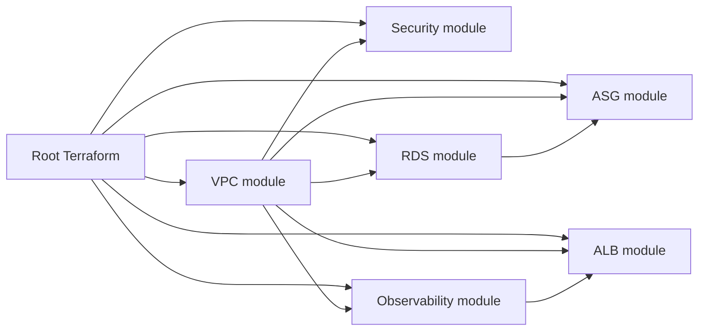

# SecVault Architecture Notes

## Design goals

SecVault uses a three-tier AWS network and adds security telemetry around it:

1. Keep internet exposure at the ALB boundary.
2. Keep application instances private and administratively reachable through SSM.
3. Keep RDS private and reachable only from the application security group.
4. Remove static database passwords from Terraform variables and EC2 user data.
5. Preserve an audit trail and route high-value security events to a notification channel.
6. Keep every security service tied to an identifiable threat or operational need.

## Resource boundaries



## Network model

- Public subnets contain the internet-facing ALB and NAT Gateway(s).
- Application subnets do not assign public IPs.
- Database subnets do not assign public IPs.
- The application security group accepts port 5000 only from the ALB security group.
- The database security group accepts MySQL 3306 only from the application security group.
- There is no SSH/RDP ingress rule.
- Application egress is limited to HTTPS, MySQL to the database tier, and VPC DNS.

## Security telemetry

```text
CloudTrail ────────┐
                   ├──> EventBridge ──> SNS
GuardDuty ─────────┤
Security Hub ──────┘       ▲
                           │
                  targeted IAM changes

VPC Flow Logs ──> CloudWatch Logs
RDS logs ───────> CloudWatch Logs
EC2 metrics ────> CloudWatch alarms
ALB access logs -> protected S3 audit bucket
```

## Region and account scope

The root stack is region-configurable. CloudTrail is configured as a multi-region trail, but the stack itself does not create an AWS Organizations-wide trail, delegated administrator, SCP, or cross-account log archive. Those controls belong in an organization/security-account baseline when SecVault is extended to multi-account AWS.

## Why some controls are optional

### Security Hub

Security Hub CSPM is exposed as `enable_security_hub` and defaults to `false`. It can be useful for centralized findings and standards, but it can create additional service usage and may already be managed centrally in an organization. SecVault does not enable it solely for a README badge.

### Multi-AZ NAT

A single NAT Gateway is the default to keep development costs manageable. Setting `single_nat_gateway = false` creates one NAT Gateway per public subnet/AZ, improving AZ isolation at higher cost.

### HTTPS

The ALB accepts an ACM certificate ARN. When provided, HTTP is redirected to HTTPS and the TLS listener uses a modern TLS 1.2/1.3 security policy. Without a certificate, the project remains usable over HTTP for demo environments.
