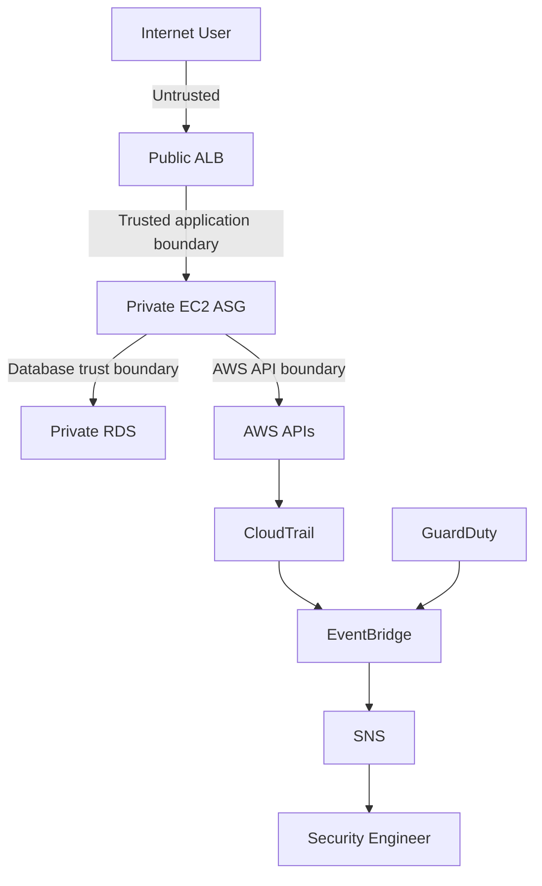

# SecVault Threat Model

SecVault uses a lightweight STRIDE-style threat model focused on the real attack surfaces of the repository.

| Threat | Attack surface | Preventive control | Detection / evidence | Response path |
|---|---|---|---|---|
| Credential compromise | AWS/API credentials | IAM roles, SSM, no static AWS keys | CloudTrail | Disable/rotate affected identity, investigate events |
| Database credential exposure | Terraform vars/user data | RDS-managed Secrets Manager secret | CloudTrail + Secrets Manager audit | Rotate secret, rebuild instances |
| Public database exposure | RDS networking | Private subnets + DB SG only from app SG | Config/Security Hub when enabled + SG review | Remove public route/access, rotate credentials |
| Application exposure | EC2 network boundary | No public IP, ALB-only ingress | ALB access logs + VPC Flow Logs | Isolate ASG / adjust SG |
| Privilege escalation | IAM APIs | Narrow EC2 policy; targeted IAM-change events | CloudTrail + EventBridge + SNS | Investigate actor, revoke policy/role change |
| Network intrusion | VPC traffic | Private tiers + SG boundaries | VPC Flow Logs + GuardDuty | Investigate source/destination and isolate workload |
| Audit tampering | CloudTrail/S3 | Protected private bucket, versioning, validation | CloudTrail itself + S3 object history | Preserve evidence, investigate IAM changes |
| CI/CD compromise | GitHub Actions | Read-only validation by default, optional OIDC role | GitHub Actions audit trail | Revoke role, review workflow changes |
| Terraform state compromise | State backend | `.gitignore`, remote encrypted backend recommended | Backend access logs / CloudTrail | Rotate affected secrets and restrict state access |
| Malicious dependency | Python / IaC dependencies | Pinned application dependencies + CI scanning | Trivy / Checkov | Upgrade, rebuild, investigate artifact provenance |

## Trust boundaries

## Assumptions

- The AWS account is not already compromised at the root/organization level.
- IAM permissions used to deploy Terraform are controlled outside this repository.
- GitHub branch protection and reviewer controls should be enabled on the primary branch.
- Security services can be affected by region/account scope and organization configuration.

## Residual risk

No control eliminates risk. The largest remaining risks are deployment-identity compromise, state/backend compromise, application vulnerabilities, dependency compromise, and organizational misconfiguration outside this stack.
